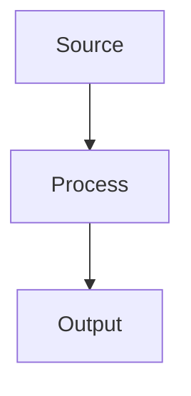

# Contributing Guide

## When to Create ADRs

**Create ADRs for foundational decisions only:**

- High cost to change mid/late project
- Architectural patterns and technology standards
- Security frameworks and compliance requirements
- Infrastructure patterns that affect multiple teams

**Don't create ADRs for:**

- Implementation details (use documentation)
- Project-specific configurations
- Operational procedures that change frequently
- Tool-specific guidance that belongs in user manuals

## Quick Workflow

1. **Open in Codespaces** → Automatic tool setup
2. **Get number** → `just next-number` (provides next sequential number)
3. **Create file** → `###-short-name.qmd` in correct directory ([see content types](#content-types-when-to-use-what))
4. **Write content** → Follow template below
5. **Validate** → `just validate` and fix issues
6. **Submit PR** → Ready for review (chapters auto-update)

## Directory Structure

| Directory | Content |
|-----------|---------|
| `development/` | API standards, CI/CD, releases |
| `operations/` | Infrastructure, logging, config |
| `security/` | Isolation, secrets, AI governance |
| `reference-architectures/` | Project kickoff templates |

## Content Types: When to Use What

### ADRs (Architecture Decision Records)

**Purpose**: Document foundational technology decisions that are expensive to change  
**Format**: `###-decision-name.qmd` in `development/`, `operations/`, or `security/`  
**Examples**: "AWS EKS for workloads", "Secrets management approach", "API standards"

### Reference Architectures  

**Purpose**: Project kickoff templates that combine multiple existing ADRs  
**Format**: `descriptive-name.qmd` in `reference-architectures/`  
**Examples**: "Content Management", "Data Pipelines", "Identity Management"

**Rule**: Reference architectures should only link to existing ADRs, not create new ones.

## ADR Template

```markdown
---
title: "ADR ###: Specific Decision Title"
date: 2025-07-22
status: Proposed
tags: [category, technology]
---

**Status:**  | **Date:** 

## Context
What problem are we solving? Include background and constraints.

## Decision
What we decided and how to implement it:

- **Requirement 1**: Specific implementation detail
- **Requirement 2**: Configuration specifics
- **Requirement 3**: Monitoring approach

## Consequences
**Positive:**
- Benefit 1 with explanation
- Benefit 2 with explanation

**Negative:**
- Risk 1 with mitigation
- Risk 2 with mitigation
```

**Important**: Tags should NOT be prefixed with # to avoid YAML parsing errors  
**Note**: ADR numbers are globally unique across all directories (gaps from removed drafts are normal)

## Reference Architecture Template

```markdown
---
title: "Reference Architecture: Pattern Name"
date: 2025-07-28
status: Proposed
tags: [reference, technology, domain]
---

## When to Use This Pattern
Clear use case description for when to apply this architecture.

## Overview
Brief template description focusing on practical implementation.

## Core Components


## Project Kickoff Steps

1. **Step Name** - Follow [ADR ###: Title](../category/###-filename.qmd) for implementation
2. **Next Step** - *ADR needed for missing standards*
3. **Final Step** - Reference to existing practices

## Quality Standards

**Before submitting:**

- [ ] Title is concise (under 50 characters) and actionable
- [ ] All acronyms defined on first use
- [ ] Active voice (not passive)
- [ ] Passes `just validate` without errors

**Title Examples:**

- GOOD: "ADR 002: AWS EKS for Cloud Workloads" (concise, ~30 chars)
- GOOD: "ADR 008: Email Authentication Protocols" (specific, clear)
- BAD: "ADR 004: Enforce release quality with CI/CD prechecks and build attestation" (too long)
- BAD: "Container stuff" or "Security improvements" (too vague)

## Commands

```bash
just next-number      # Get next ADR number (auto-increments from highest)
just validate        # Check format + prose quality (5 validation tools)
just serve          # Preview website locally (port 8080)
just clean          # Remove generated files
just update-chapters  # Refresh _quarto.yml chapters (auto-runs on build)
```

**Validation includes**: markdownlint, Vale style, frontmatter schema, yq parsing, and custom checks

## Status Guide

| Status | Meaning |
|--------|---------|
| `Proposed` | Under review |
| `Accepted` | Active decision |
| `Superseded` | Replaced by newer ADR |

## ADR References

**In frontmatter (for strong relationships):**

```yaml
supersedes: "012"     # This ADR replaces ADR 012
related: ["005", "007"]  # Related to ADRs 005 and 007
```

**In text (for implementation details):**

- Reference format: `[ADR 005: Secrets Management](../security/005-secrets-management.qmd)`
- Quick reference: `per ADR 005`
- Multiple refs: `aligned with ADR 001 and ADR 005`

**Examples:**

- Implementation: "Encryption handled per [ADR 005: Secrets Management](../security/005-secrets-management.qmd)"
- Quick mention: "Access controls aligned with ADR 001"
- Multiple: "Following standards from ADR 003 and ADR 009"

## Writing Tips

- **Be specific**: "Use AWS EKS auto mode" not "Use containers"
- **Include implementation**: How, not just what
- **Define scope**: What's included and excluded
- **Reference standards**: Link to external docs
- **Use Australian English**: "organisation" not "organization", "colour" not "color"

## Reference Architecture Guidelines

**Purpose**: Project kickoff templates linking foundational ADRs for faster, consistent delivery

**Consolidated Approach**:

- **9-11 foundational steps maximum** linking to existing ADRs only
- **Implementation Details section** for specifics that don't need ADRs
- **Focus on high-cost-to-change decisions** (architectural patterns, technology standards, security frameworks)
- **Avoid creating ADRs** for implementation details that can be handled in documentation

**Structure**:

- **When to Use**: Clear use case description
- **Overview**: Brief template description  
- **Core Components**: Mermaid diagram showing architecture flow
- **Project Kickoff Steps**: Foundational ADRs grouped by logical sections (Foundation, Security, Development)
- **Implementation Details**: Bullet points for project-specific guidance

**Content Rules**:

- Link to existing foundational ADRs only
- Use "Implementation Details" for specifics instead of creating new ADRs
- Consolidate related concerns into existing comprehensive ADRs
- Use "jurisdiction" not "government" for broad applicability
