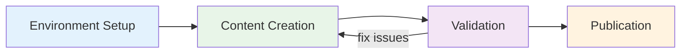

# Contributing Guide

**Status:** Accepted | **Date:** 2026-06-09 | **Review:** 2027-06-09

## When to Create ADRs

**Create ADRs for foundational decisions only:**

- High cost to change mid/late project
- Architectural patterns and technology standards
- Security frameworks and compliance requirements
- Infrastructure patterns that affect multiple teams

**Do not create ADRs for:**

- Implementation details (use documentation)
- Project-specific configurations
- Operational procedures that change frequently
- Tool-specific guidance that belongs in user manuals

## Quick Workflow

1. **Open in Codespaces** - Automatic tool setup
2. **Get number** - `just next-number`
3. **Create file** - `###-short-name.md` in correct directory ([see content types](#content-types-when-to-use-what))
4. **Write content** - Follow template below
5. **Set annual review metadata** - `Review` must be one year after `Date`
6. **Add to SUMMARY.md** - Include new ADR in navigation (required for mdBook)
7. **Lint** - `just lint` to fix formatting, check metadata, check SUMMARY.md, and validate links
8. **Submit PR** - Ready for review

## Useful Commands

```bash
just --list      # Show all available commands
just next-number # Get next ADR number
just check-summary # Verify SUMMARY.md includes all markdown files
just check-metadata # Verify status/date/review metadata
just lint        # Run checks and fixes
just serve       # Preview locally on port 8080
just build       # Build website and print view
```

## AI-Assisted Contributions

AI tools may help draft or review ADRs, but a human contributor remains
responsible for the final content.

- Prefer isolated or local AI tooling per [ADR 011: AI Tool and Agent Governance](security/011-ai-governance.md)
- Review [adr-design-guardrails.md](adr-design-guardrails.md) before proposing changes
- Browse [reference-architectures/](reference-architectures/) for project kickoff patterns
- Check existing ADRs in `development/`, `operations/`, and `security/` before creating new guidance
- Human review is required for all AI-generated changes before merge
- Recommended tools include [OpenCode](https://github.com/wagov-dtt/tutorials-and-workshops/blob/main/README.md#opencode-ai-agent) and [Goose](https://github.com/block/goose)


```mermaid
flowchart LR
    setup[Environment Setup]
    create[Content Creation]
    validate[Validation]
    publish[Publication]

    setup --> create --> validate --> publish
    validate -->|fix issues| create

    style setup fill:#e3f2fd
    style create fill:#e8f5e8
    style validate fill:#f3e5f5
    style publish fill:#fff3e0
```

## Project Notes

- Documentation is built with [mdBook](https://rust-lang.github.io/mdBook/)
- Navigation is defined in `SUMMARY.md`; new ADRs must be added there
- `just build` creates the website and a single-page print view
- Use Mermaid diagrams where a simple visual explanation is clearer than text alone
- Each maintained guidance page has `Status`, `Date`, and `Review` metadata
- Review dates are annual by default: set `Review` exactly one year after `Date`

## Directory Structure

| Directory | Content |
|-----------|---------|
| `development/` | API standards, CI/CD, releases |
| `operations/` | Infrastructure, logging, config |
| `security/` | Isolation, secrets, AI governance |
| `reference-architectures/` | Project kickoff templates |

## Content Types: When to Use What

### ADRs (Architecture Decision Records)

**Purpose**: Document foundational technology decisions that are expensive to change  
**Format**: `###-decision-name.md` in `development/`, `operations/`, or `security/`  
**Examples**: "AWS EKS for workloads", "Secrets management approach", "API standards"

### Reference Architectures  

**Purpose**: Project kickoff templates that combine multiple existing ADRs  
**Format**: `descriptive-name.md` in `reference-architectures/`  
**Examples**: "Content Management", "Data Pipelines", "Identity Management"

**Rule**: Reference architectures should only link to existing ADRs, not create new ones.

## ADR Template

See [templates/adr-template.md](templates/adr-template.md) for the complete template.

**Note**: ADR numbers are globally unique across all directories (gaps from removed drafts are normal)

## Reference Architecture Template

See [templates/reference-architecture-template.md](templates/reference-architecture-template.md) for the complete template.

## Quality Standards

**Before submitting:**

- [ ] Title is concise (under 50 characters) and actionable
- [ ] Status, date, and annual review metadata are present
- [ ] All acronyms defined on first use
- [ ] Active voice (not passive)
- [ ] Scope, non-goals, and related ADRs are clear
- [ ] Implementation checklist is specific enough for project kickoff
- [ ] Passes `just lint` without errors

**Title Examples:**

- GOOD: "ADR 002: AWS EKS for Cloud Workloads" (concise, ~30 chars)
- GOOD: "ADR 008: Email Authentication Protocols" (specific, clear)
- BAD: "ADR 004: Enforce release quality with CI/CD prechecks and build attestation" (too long)
- BAD: "Container stuff" or "Security improvements" (too vague)

## Status Guide

| Status | Meaning |
|--------|---------|
| `Proposed` | Under review |
| `Accepted` | Active decision |
| `Superseded` | Replaced by newer ADR |

Use this metadata line directly below the title:

```markdown
**Status:** Proposed | **Date:** YYYY-MM-DD | **Review:** YYYY-MM-DD
```

Set `Review` to the same month and day in the following year. For example,
`Date: 2026-06-09` uses `Review: 2027-06-09`.

## Annual Review Checklist

Use this checklist for every scheduled review:

- [ ] Status is still correct: Proposed, Accepted, or Superseded
- [ ] Decision still reflects current WA Government policy and standards
- [ ] External links still resolve and point to the intended guidance
- [ ] Related ADR links are current
- [ ] Compliance mapping is still accurate
- [ ] Implementation checklist remains practical for new projects
- [ ] Acronyms, glossary terms, and diagrams remain clear
- [ ] Review date is advanced by one year after the review is complete

## ADR References

**Reference format:**

- `[ADR 005: Secrets Management](../security/005-secrets-management.md)`
- Quick reference: `per ADR 005`
- Multiple refs: `aligned with ADR 001 and ADR 005`

**Examples:**

- "Encryption handled per [ADR 005: Secrets Management](security/005-secrets-management.md)"
- "Access controls aligned with ADR 001"

## Writing Tips

- **Be specific**: "Use AWS EKS auto mode" not "Use containers"
- **Include implementation**: How, not just what
- **Define scope**: What's included and excluded
- **State non-goals**: Help readers avoid using an ADR outside its intended scope
- **Link by decision**: Prefer ADR links over repeating requirements in multiple places
- **Reference standards**: Link to external docs
- **Australian English**: Use "organisation" not "organization", "jurisdiction" not "government"
- **Character usage**: Use plain-text safe Unicode - avoid emoji, smart quotes, em-dashes for print page compatibility
- **Mermaid diagrams**: Use Mermaid for diagrams with clean syntax and universal compatibility
  - Use when text alone isn't sufficient (system relationships, data flows, workflows)
  - Keep simple: 5-7 components max, clear labels, logical flow
  - Use `flowchart TB` for compact layouts, `flowchart LR` for flows
  - Use `style` directives for color styling, keep labels short
