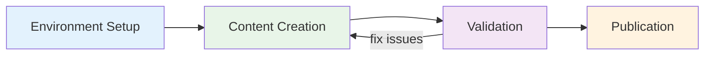

## Contributing Guide

### When to Create ADRs

**Create ADRs for foundational decisions only:**

- High cost to change mid/late project
- Architectural patterns and technology standards
- Security frameworks and compliance requirements
- Infrastructure patterns that affect multiple teams

**Do not create ADRs for:**

- Implementation details (use documentation)
- Project-specific configurations
- Operational procedures that change frequently
- Tool-specific guidance that belongs in user manuals

### Quick Workflow

1. **Open in Codespaces** - Automatic tool setup
2. **Get number** - `just next-number`
3. **Create file** - `###-short-name.md` in correct directory ([see content types](#content-types-when-to-use-what))
4. **Write content** - Follow template below
5. **Lint** - `just lint` to fix formatting, check content metadata, and validate links
6. **Set front matter** - Include title, description, weight, and `toc: true` for Hugo navigation
7. **Submit PR** - Ready for review

### Useful Commands

```bash
just --list      # Show all available commands
just next-number # Get next ADR number
just check-content # Verify Hugo content conventions
just lint        # Run checks and fixes
just serve       # Preview locally on port 8080
just build       # Build website and printable view
```

### AI-Assisted Contributions

AI tools may help draft or review ADRs, but a human contributor remains
responsible for the final content.

- Prefer isolated or local AI tooling per [ADR 011: AI Tool and Agent Governance](/docs/security/011-ai-governance/)
- Review [Architecture Principles](/docs/architecture-principles/) before proposing changes
- Browse [Reference Architectures](/docs/reference-architectures/) for project kickoff patterns
- Check existing ADRs in `content/docs/development/`, `content/docs/operations/`, and `content/docs/security/` before creating new guidance
- Human review is required for all AI-generated changes before merge
- Recommended tools include [OpenCode](https://github.com/wagov-dtt/tutorials-and-workshops/blob/main/README.md#opencode-ai-agent) and [Goose](https://github.com/block/goose)



### Project Notes

- Documentation is built with [Hugo](https://gohugo.io/) and [Lotus Docs](https://lotusdocs.dev/)
- Navigation is defined by Hugo front matter; new pages need an appropriate `weight`
- `just build` creates the website, including the single-page printable view
- Use Mermaid diagrams where a simple visual explanation is clearer than text alone

### Directory Structure

| Directory | Content |
|-----------|---------|
| `content/docs/development/` | API standards, CI/CD, releases |
| `content/docs/operations/` | Infrastructure, logging, config |
| `content/docs/security/` | Isolation, secrets, AI governance |
| `content/docs/reference-architectures/` | Project kickoff templates |

### Content Types: When to Use What

#### ADRs (Architecture Decision Records)

**Purpose**: Document foundational technology decisions that are expensive to change  
**Format**: `###-decision-name.md` in `content/docs/development/`, `content/docs/operations/`, or `content/docs/security/`
**Examples**: "AWS EKS for workloads", "Secrets management approach", "API standards"

#### Reference Architectures

**Purpose**: Project kickoff templates that combine multiple existing ADRs  
**Format**: `descriptive-name.md` in `content/docs/reference-architectures/`
**Examples**: "Content Management", "Data Pipelines", "Identity Management"

**Rule**: Reference architectures should only link to existing ADRs, not create new ones.

### ADR Template

See [templates/adr-template.md](/docs/templates/adr-template/) for the complete template.

**Note**: ADR numbers are globally unique across all directories (gaps from removed drafts are normal)

### Reference Architecture Template

See [templates/reference-architecture-template.md](/docs/templates/reference-architecture-template/) for the complete template.

### Quality Standards

**Before submitting:**

- [ ] Title is concise (under 50 characters) and actionable
- [ ] All acronyms defined on first use
- [ ] Active voice (not passive)
- [ ] Passes `just lint` without errors

**Title Examples:**

- GOOD: "ADR 002: AWS EKS for Cloud Workloads" (concise, ~30 chars)
- GOOD: "ADR 008: Email Authentication Protocols" (specific, clear)
- BAD: "ADR 004: Enforce release quality with CI/CD prechecks and build attestation" (too long)
- BAD: "Container stuff" or "Security improvements" (too vague)

### Status Guide

| Status | Meaning |
|--------|---------|
| `Proposed` | Under review |
| `Accepted` | Active decision |
| `Superseded` | Replaced by newer ADR |

### ADR References

**Reference format:**

- `[ADR 005: Secrets Management](/docs/security/005-secrets-management/)`
- Quick reference: `per ADR 005`
- Multiple refs: `aligned with ADR 001 and ADR 005`

**Examples:**

- "Encryption handled per [ADR 005: Secrets Management](/docs/security/005-secrets-management/)"
- "Access controls aligned with ADR 001"

### Writing Tips

- **Be specific**: "Use AWS EKS auto mode" not "Use containers"
- **Include implementation**: How, not just what
- **Define scope**: What's included and excluded
- **Reference standards**: Link to external docs
- **Australian English**: Use "organisation" not "organization", "jurisdiction" not "government"
- **Character usage**: Use plain-text safe Unicode for portability
- **Mermaid diagrams**: Use Mermaid format for diagrams with clean syntax and broad web support
  - Use when text alone isn't sufficient (system relationships, data flows, workflows)
  - Keep simple: 5-7 components max, clear labels, logical flow
  - Prefer `flowchart LR` for flows and `flowchart TD` for compact layouts
