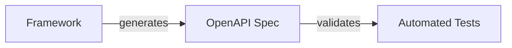

## ADR 003: API Documentation Standards

**Status:** Accepted | **Date:** 2025-03-26

### Context

Secure, maintainable APIs require mature frameworks with low complexity and industry standard compliance. Where existing standards exist, prefer them over bespoke REST APIs.

**Compliance Requirements:**

- [ACSC Software Development Guidelines](https://www.cyber.gov.au/resources-business-and-government/essential-cyber-security/ism/cyber-security-guidelines/guidelines-software-development)
- [OWASP API Security](https://owasp.org/www-project-api-security/)
- [OpenAPI Specification](https://spec.openapis.org/)

### Decision

#### API Requirements

| Requirement | Standard | Mandatory |
|-------------|----------|-----------|
| **Documentation** | [OpenAPI Specification](https://spec.openapis.org/) | Yes |
| **Testing** | [Restish CLI](https://rest.sh/#/openapi) scripts | Yes |
| **Framework** | [Huma](https://huma.rocks/) (Go), [Litestar](https://litestar.dev/) (Python), or equivalent | Recommended |
| **Naming** | Consistent convention | Yes |
| **Security** | OWASP API security coverage | Yes |
| **Exposure** | No admin APIs on Internet | Yes |

#### Development Guidelines

- **Self-Documenting**: Use frameworks that auto-generate OpenAPI specs
- **Data Types**: Prefer standard types over custom formats
- **Segregation**: Separate APIs by purpose (see [Reference Architecture:
  OpenAPI Backend](/docs/reference-architectures/openapi-backends/))
- **Testing**: Include security vulnerability checks in test scripts

**API Development Flow:**

Use self-documenting frameworks that generate OpenAPI specifications,
then validate with automated security and behaviour tests.

### Consequences

**Benefits:**

- Standardised API documentation automatically generated from code
- Enhanced security through consistent validation patterns
- Reduced maintenance overhead via automated testing integration

**Risks if not implemented:**

- Documentation drift creating integration difficulties
- Security vulnerabilities from inconsistent API patterns
- Increased development time debugging undocumented APIs
