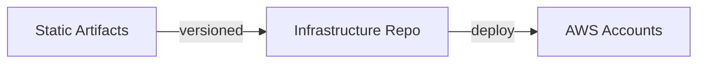

## ADR 010: Infrastructure as Code

**Status:** Accepted | **Date:** 2025-03-10

### Context

All environments must be reproducible from source to minimise drift and security risk. Manual changes and missing version control create deployment failures and vulnerabilities.

**Compliance Requirements:**

- [OWASP IaC Security](https://cheatsheetseries.owasp.org/cheatsheets/Infrastructure_as_Code_Security_Cheat_Sheet.html)
- [ACSC System Hardening](https://www.cyber.gov.au/resources-business-and-government/essential-cybersecurity/ism/cybersecurity-guidelines/guidelines-system-hardening)

### Decision

#### Golden Path

1. **Git Repository Structure**: Single repo per application with `environments/{dev,int,uat,prod}` folders matching AWS account names, for example `app-a-dev`, `app-a-int`, `app-a-uat`, and `app-a-prod`
2. **State Management**: Terraform remote state with locking, separate state per environment
3. **CI Pipeline**:
   - **Validate**: Trivy scan + `terraform plan`/`kubectl diff` drift check
   - **Plan**: Show proposed changes on PR
   - **Apply**: DEV and INT may deploy approved branch refs; UAT and PROD deploy tagged releases only per [ADR 009](/docs/development/009-release/)
4. **Versioning**: Git tags = semantic versions (x.y.z) created on `main` for UAT and PROD
5. **Disaster Recovery**: Checkout tag + run `just deploy --env=prod` with static artifacts from [ADR 004](/docs/development/004-cicd/)

#### Required Tools & Practices

| Tool | Purpose | Stage | Mandatory |
|------|---------|-------|-----------|
| [Trivy](https://trivy.dev/latest/docs/configuration/) | Vulnerability scanning | Validate | Yes |
| [Terraform](https://developer.hashicorp.com/terraform/docs) or [kubectl/kustomize](https://kubectl.docs.kubernetes.io/guides/config_management/) | Configuration management | Deploy | Yes |
| [Justfiles](https://just.systems/man/en/) | Task automation | All | Recommended |
| [devcontainer-base](https://github.com/wagov-dtt/devcontainer-base) | Dev environment | Local | Recommended |
| [k3d](https://k3d.io/stable/) | Local testing | Dev | Optional |

**Infrastructure as Code Workflow:**

Git tags are immutable release versions for UAT and PROD. DEV and INT
may deploy approved branch refs per [ADR 009](/docs/development/009-release/).
Environment folders (`environments/{dev,int,uat,prod}`) map to separate
AWS accounts with isolated state storage.

### Consequences

**Benefits:**

- Reproducible infrastructure deployments with version control
- Automated drift detection and prevention mechanisms
- Reliable disaster recovery through infrastructure as code

**Risks if not implemented:**

- Configuration drift creating security vulnerabilities
- Failed rollbacks during critical incident recovery
- Inconsistent environments affecting application reliability

### References

- [ADR 001: Application Isolation](/docs/security/001-isolation/)
- [ADR 002: AWS EKS for Cloud Workloads](/docs/operations/002-workloads/)
- [ADR 005: Secrets Management](/docs/security/005-secrets-management/)
