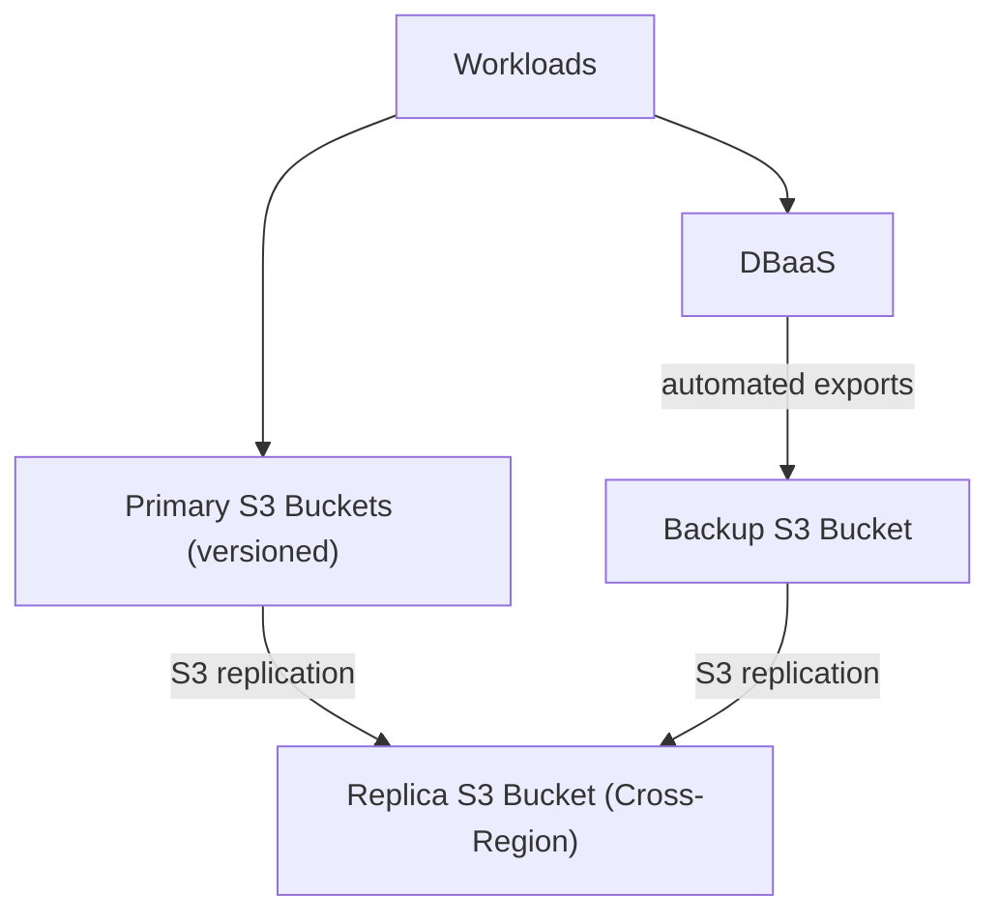

## ADR 014: Object Storage Backups

**Status:** Proposed | **Date:** 2025-07-22

### Context

Current backup approaches lack cross-region redundancy and automated
lifecycle management, creating single points of failure and compliance
risks for government data retention requirements. Traditional storage
systems do not provide the durability and geographic distribution needed
for critical government systems.

Key challenges:

- Single region backup storage creating vulnerability to regional
  outages
- Manual backup processes prone to human error
- Lack of automated recovery testing
- Insufficient geographic separation for disaster recovery

References:

- [ACSC Information Security Manual
  (ISM)](https://www.cyber.gov.au/resources-business-and-government/essential-cyber-security/ism)
- [AWS Well-Architected Framework - Reliability
  Pillar](https://docs.aws.amazon.com/wellarchitected/latest/reliability-pillar/welcome.html)

### Decision

Implement standardised object storage backup solution with automated
cross-region replication and lifecycle management for all critical
systems and data.

All storage (primary, backup, and replica) uses S3 buckets with
versioning and immutable retention policies. Primary S3 buckets use
native versioning for point-in-time recovery. DBaaS exports to backup
buckets. Both primary and backup buckets replicate cross-region for
geographic redundancy.

**Storage Requirements:**

- Object storage with versioning and immutable storage capabilities
- Shared file stores that use object storage per [ADR 019: Shared File
  Access](/operations/019-shared-file-access.html)
- Database, application data, and infrastructure configuration backups
- Encryption at rest and in transit per [ADR 005: Secrets
  Management](/security/005-secrets-management.html)
- Access controls aligned with [ADR 001: Application
  Isolation](/security/001-isolation.html)

**Critical Systems Definition:**

- Production databases containing citizen or business data
- Shared content, media, and file assets required to restore services
- Application source code and deployment configurations
- Security logs and audit trails
- Infrastructure as Code templates and state files

**Geographic Distribution:**

- Cross-region replication within Australia (e.g., ap-southeast-2 to
  ap-southeast-4)
- Monitoring integration per [ADR 007: Centralised Security
  Logging](/operations/007-logging.html)

**Lifecycle Management:**

- Automated storage tiering based on age and access patterns
- Compliance-based retention policies
- Recovery testing and validation procedures

**Recovery Objectives:**

- **Recovery Time Objective (RTO)**: 4 hours for critical systems, 24
  hours for standard systems
- **Recovery Point Objective (RPO)**: 1 hour for databases, 24 hours for
  static content
- **Implementation Example**: [AWS S3 Cross-Region
  Replication](https://docs.aws.amazon.com/AmazonS3/latest/userguide/replication.html)
  to Australian regions

### Consequences

**Benefits:**

- Automated disaster recovery meeting defined RTO/RPO objectives
- Geographic redundancy protecting against regional outages
- Compliance with government data retention requirements

**Risks if not implemented:**

- Permanent data loss from infrastructure failures
- Extended service recovery times affecting citizen services
- Regulatory violations from inadequate data protection
