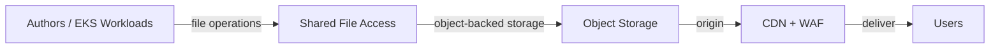

## ADR 019: Shared File Access

**Status:** Accepted | **Date:** 2026-04-27

### Context

Some workloads need both object APIs and file-system access to the same
files. Examples include content management systems, media processing,
shared workspaces, AI/ML tooling, and EKS workloads that expect paths,
folders, and ordinary file operations.

Without a standard pattern, teams may copy the same files between object
storage, network file systems, and CDN origins. This creates
synchronisation risk, extra cost, and unclear backup and retention
ownership.

References:

- [Amazon S3 Files](https://aws.amazon.com/s3/features/files/)
- [Amazon CloudFront with S3
  origins](https://docs.aws.amazon.com/AmazonCloudFront/latest/DeveloperGuide/DownloadDistS3AndCustomOrigins.html)
- [ADR 002: AWS EKS for Cloud Workloads](/docs/operations/002-workloads/)
- [ADR 014: Object Storage Backups](/docs/operations/014-object-backup/)
- [ADR 016: Web Application Edge
  Protection](/docs/security/016-edge-protection/)

### Decision

Use object storage as the source of truth for shared files that also need
backup, lifecycle management, or CDN delivery. On AWS, use S3 buckets for
the canonical storage layer.

Use [Amazon S3 Files](https://aws.amazon.com/s3/features/files/) when
applications, users, or agents need shared file-system access to S3 data
from AWS compute, including EKS workloads. This is the preferred pattern
for CMS media libraries, static assets, shared workspaces, AI/ML data,
and other file assets that benefit from both object and file access.

Avoid copying canonical files into separate file systems unless a workload
has a hard requirement that object-backed file access cannot meet.

#### Requirements

- Store canonical files in object storage with versioning, encryption,
  lifecycle policies, and backups per [ADR 014](/docs/operations/014-object-backup/)
- Use managed shared file access for workloads that need paths, folders,
  and ordinary file operations
- Scope working sets and least-privilege access with bucket prefixes, policy,
  access points, or equivalent storage boundaries
- Publish public assets through a CDN and WAF per [ADR 016](/docs/security/016-edge-protection/)
- Use workload identity and scoped IAM permissions for EKS access per
  [ADR 002](/docs/operations/002-workloads/) and [ADR 005: Secrets
  Management](/docs/security/005-secrets-management/)
- Define ownership, lifecycle, retention, and recovery expectations for
  each shared file store

### Consequences

**Benefits:**

- One source of truth for object, file, backup, and CDN access
- Less data duplication and fewer synchronisation pipelines
- Familiar file operations for EKS workloads and other AWS compute
- Clearer ownership for retention, recovery, and public asset delivery

**Risks if not implemented:**

- Teams may duplicate files between object storage and file systems
- CDN assets may drift from files used by authoring or processing tools
- Backup, retention, and ownership boundaries may become unclear
