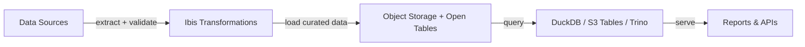

## Reference Architecture: Data Pipelines

**Status:** Proposed | **Date:** 2025-01-28

### When to Use This Pattern

Use when building:

- Analytics and business intelligence reporting
- Data integration between organisational systems
- Batch data processing and transformation workflows
- Small to medium data products that should start simple and scale later

Do not use this pattern as a default for low-latency transactional APIs or
streaming systems with sub-second processing requirements.

### Overview

Build data pipelines as version-controlled transformation code over an
object-storage datalake. Keep storage and table formats separate from the
access layer so teams can start with DuckDB/DuckLake and add S3 Tables,
Trino, or other Iceberg-compatible engines when concurrency or scale
requires it.

### Core Components

**Key Technologies:**

| Component | Tool | Purpose |
|-----------|------|---------|
| **Transformation** | [Ibis](https://ibis-project.org/) | Portable Python dataframe API for transformations across local and cloud engines |
| **Local Access** | [DuckDB](https://duckdb.org/) + [DuckLake](https://ducklake.select/) | Lightweight client and lakehouse access for development, scheduled jobs, and smaller workloads |
| **Serverless Tables** | [Amazon S3 Tables](https://aws.amazon.com/s3/features/tables/) | Managed Apache Iceberg table storage and maintenance for AWS workloads |
| **Distributed Query** | [Trino](https://trino.io/current/connector/iceberg.html) or equivalent | Concurrent and larger-scale SQL access to Iceberg tables |
| **Reporting** | [Quarto](https://quarto.org/) | Static reports and dashboards from version-controlled notebooks |

### Project Kickoff Steps

#### Foundation Setup

1. **Apply Isolation** - Follow [ADR 001: Application
   Isolation](/security/001-isolation.html) for data processing network
   and account boundaries
2. **Deploy Workloads** - Follow [ADR 002: AWS EKS for Cloud
   Workloads](/operations/002-workloads.html) for scheduled pipeline
   jobs when local or CI execution is not sufficient
3. **Configure Infrastructure** - Follow [ADR 010: Infrastructure as
   Code](/operations/010-configmgmt.html) for buckets, table resources,
   permissions, and deployment environments
4. **Setup Storage and Access** - Follow [ADR 018: Database
   Patterns](/operations/018-database-patterns.html) for object storage,
   DuckLake, S3 Tables, and Iceberg-compatible access layers

#### Security & Operations

1. **Configure Secrets** - Follow [ADR 005: Secrets
   Management](/security/005-secrets-management.html) for source system
   credentials and scoped storage access
2. **Setup Logging** - Follow [ADR 007: Centralised Security
   Logging](/operations/007-logging.html) for pipeline runs, data access,
   and failures
3. **Setup Backups** - Follow [ADR 014: Object Storage
   Backups](/operations/014-object-backup.html) for datalake backup,
   replication, and recovery objectives
4. **Apply Data Governance** - Follow [ADR 015: Data Governance
   Standards](/operations/015-data-governance.html) for ownership,
   quality, classification, and retention

#### Development Process

1. **Configure CI/CD** - Follow [ADR 004: CI/CD Quality
   Assurance](/development/004-cicd.html) for automated testing and
   deployment
2. **Setup Releases** - Follow [ADR 009: Release
   Standards](/development/009-release.html) for versioned pipeline
   changes, release notes, promotion, and data-impact notes
3. **Publish Analytics** - Follow [ADR 017: Analytics Tooling
   Standards](/operations/017-analytics-tooling.html) for Quarto reports
   and dashboards

### Implementation Details

**Access Layer Selection:**

- Use DuckDB + DuckLake for local development, scheduled jobs, notebooks,
  and simpler analytical workloads
- Use S3 Tables for managed Iceberg tables when AWS-managed table
  maintenance, catalog integration, or multi-engine access is required
- Use Trino or another Iceberg-compatible query engine when many users or
  services need concurrent SQL access
- Keep transformation logic in Ibis where practical so the same code can
  move between access layers

**Data Quality:**

- Validate schemas and business rules during ingestion and transformation
- Run schema and sample-data checks in CI/CD
- Track lineage through transformation code, table names, and release
  notes

**Operations:**

- Partition tables by common query and retention boundaries
- Use lifecycle policies and replication for backup and cost control
- Start with the simplest access layer and add distributed query only
  when measured concurrency or scale requires it
