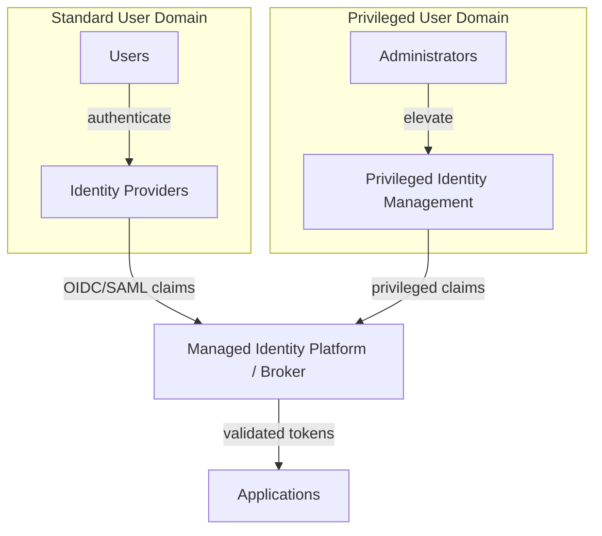

## Reference Architecture: Identity Management

**Status:** Proposed | **Date:** 2025-07-29

### When to Use This Pattern

Use when building:

- Applications requiring user login via government or enterprise identity
  providers
- Single sign-on across multiple services
- Integration with Australian Government Digital ID or verifiable
  credentials
- Services that need separate standard-user and privileged-user access
  paths

Do not use this pattern to create a new identity provider when a managed
identity platform can meet the need.

### Overview

Use a managed identity platform as the relying-party integration point
for applications. Add a broker layer only when the service must normalise
multiple upstream identity providers, verifiable credentials, or policy
requirements that applications should not implement directly.

### Identity Federation Pattern

The pattern separates standard user authentication from privileged
administration. Both paths issue standard OIDC/SAML claims to downstream
applications, with audit logging and policy enforcement at the managed
platform or broker layer.

**Key Benefits:**

- Single integration point for multiple upstream providers
- Standard OIDC/SAML interface for downstream applications
- Separate privileged and standard user domains
- Centralised policy enforcement and audit logging

### Core Components

### Project Kickoff Steps

1. **Define Trust Boundaries** - Follow [ADR 001: Application
   Isolation](/security/001-isolation.html) to separate identity runtime,
   application runtime, and administrative access paths
2. **Deploy Runtime** - Follow [ADR 002: AWS EKS for Cloud
   Workloads](/operations/002-workloads.html) only for broker components
   that cannot be provided by a managed platform
3. **Configure Identity Federation** - Follow [ADR 013: Identity
   Federation Standards](/security/013-identity-federation.html) for
   OIDC-first integration, SAML fallback, claim mapping, and downstream
   consumer configuration
4. **Configure Persistence** - Follow [ADR 018: Database
   Patterns](/operations/018-database-patterns.html) for broker state,
   session metadata, and configuration storage where required
5. **Secure Secrets and Logs** - Follow [ADR 005: Secrets
   Management](/security/005-secrets-management.html) for OIDC client
   secrets and [ADR 007: Centralised Security
   Logging](/operations/007-logging.html) for authentication audit trails
6. **Privileged Administration** - Follow [ADR 012: Privileged Remote
   Access](/security/012-privileged-remote-access.html) for break-glass
   and administrator access

### Implementation Considerations

**Provider and Claim Design:**

- Prefer OIDC for new integrations; use SAML only where the upstream
  provider cannot support OIDC
- Define required claims, optional claims, and claim transformation rules
  before application integration
- Avoid persistent cross-service identifiers unless there is a lawful and
  documented need
- Keep application authorization decisions close to the application while
  centralising authentication and identity proofing

**Privacy & PII Protection:**

- Minimise collected identity attributes to what each service needs
- Prevent tracking across services using persistent identifiers unless
  explicitly justified
- Prohibit disclosure of identity information for marketing purposes
- Ensure voluntary Digital ID participation where legislation requires it
- Define breach notification and fraud incident response processes

**Assurance and Administration:**

- Match identity proofing and authentication levels to transaction risk
  and data sensitivity
- Separate standard user login from privileged administration and support
  step-up authentication for high-risk actions
- Maintain audit trails for login, consent, claim release, privilege
  elevation, and administrative configuration changes
- Implement fallback authentication for critical services

**Standards Compliance:**

- Verifiable credentials: [ISO/IEC
  18013-5:2021](https://www.iso.org/standard/69084.html) and [W3C
  Verifiable Credentials](https://www.w3.org/TR/vc-data-model/)
- Government Digital ID: [Digital ID Act
  2024](https://www.digitalidsystem.gov.au/what-is-digital-id/digital-id-act-2024)
  privacy and security requirements
- International interoperability: [eIDAS
  Regulation](https://digital-strategy.ec.europa.eu/en/policies/eidas-regulation)
  patterns
