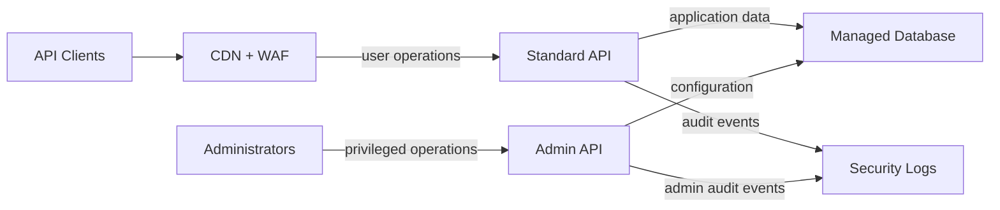

## Reference Architecture: OpenAPI Backend

**Status:** Proposed | **Date:** 2025-07-28

### When to Use This Pattern

Use when building:

- Backend services consumed by web, mobile, or system clients
- Services requiring clear separation between public and administrative
  operations
- APIs that need generated documentation, contract testing, and stable
  versioning

Do not use this pattern for static content delivery, event-only systems,
or simple data extracts that do not need a request/response API.

### Overview

Build APIs from an OpenAPI contract generated or validated in CI. Expose
standard user operations through a protected public API and keep
administrative operations on a separate endpoint, authentication realm,
and network path.

### Core Components

**Standard APIs** (`api.example.com/v1/*`): Business operations for
authenticated users or system clients.

**Admin APIs** (`admin.example.com/v1/*`): System management for
privileged users. Do not expose admin APIs directly to the Internet.

### Project Kickoff Steps

1. **Infrastructure Foundation** - Follow [ADR 001: Application
   Isolation](/security/001-isolation.html) and [ADR 002: AWS EKS for
   Cloud Workloads](/operations/002-workloads.html) for runtime and
   environment separation
2. **API Standards** - Follow [ADR 003: API Documentation
   Standards](/development/003-apis.html) for OpenAPI generation,
   validation, and testing
3. **Identity Federation** - Follow [ADR 013: Identity Federation
   Standards](/security/013-identity-federation.html) for separate
   standard and privileged authentication realms
4. **Edge Protection** - Follow [ADR 016: Web Application Edge
   Protection](/security/016-edge-protection.html) for WAF, rate
   limiting, TLS, and public API protection
5. **Database & Secrets** - Follow [ADR 018: Database
   Patterns](/operations/018-database-patterns.html) for managed
   persistence and [ADR 005: Secrets
   Management](/security/005-secrets-management.html) for runtime secrets
6. **Logging & Monitoring** - Follow [ADR 007: Centralised Security
   Logging](/operations/007-logging.html) for user, system, and admin
   audit trails

### Implementation Details

**API Contract:**

- Generate or validate OpenAPI specifications in CI for every API change
- Version public routes with stable prefixes such as `/v1`
- Use standard schema types and consistent error responses
- Publish documentation from the same specification used for tests

**Security Boundaries:**

- Keep admin APIs on separate hostnames, routes, authentication realms,
  and network controls
- Apply least-privilege database access separately for standard and admin
  operations
- Validate all request bodies, path parameters, query parameters, and
  response schemas
- Log security-relevant user, system, and administrative events

**Operations:**

- Use health, readiness, and dependency checks for deployment automation
- Apply rate limits by client, route, and risk level
- Test contract compatibility before deployment and document breaking
  changes in release notes
