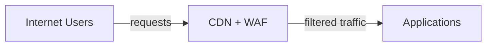

## ADR 016: Web Application Edge Protection

**Status:** Accepted | **Date:** 2025-08-15

### Context

Government web applications face heightened security threats including
state-sponsored attacks, DDoS campaigns by activist groups, and
sophisticated application-layer exploits targeting public services.
These attacks can disrupt critical citizen services and damage public
trust.

Traditional perimeter security is insufficient for protecting modern web
applications that serve millions of citizens. Edge protection through
CDNs and WAFs provides the first line of defense, filtering malicious
traffic before it reaches application infrastructure.

References:

- [ACSC Information Security Manual
  (ISM)](https://www.cyber.gov.au/resources-business-and-government/essential-cyber-security/ism)
- [ACSC Guidelines for System
  Hardening](https://www.cyber.gov.au/acsc/view-all-content/publications/hardening-linux-workstations-and-servers)
- [OWASP Web Application Security Testing
  Guide](https://owasp.org/www-project-web-security-testing-guide/)

### Decision

All public web applications and APIs must use CDN with integrated WAF
protection:

The CDN edge handles SSL termination, caching, WAF filtering, and DDoS
mitigation before traffic reaches application infrastructure.

**CDN Requirements:**

- Geographic distribution with SSL/TLS termination at edge
- Cache optimization and origin shielding
- Object-backed origins for static and media assets, using [ADR 019:
  Shared File Access](/operations/019-shared-file-access.html) when
  authoring or processing workloads need file-system access
- IPv6 dual-stack support on edge (internal use of IPv4 allowed)

**WAF Protection:**

- OWASP Top 10 protection rules enabled
- Layer 7 DDoS protection and rate limiting
- Geo-blocking and bot management
- Custom rules for application-specific threats

**DDoS Protection:**

- AWS Shield Advanced or equivalent
- Real-time attack monitoring and alerting
- DDoS Response Team access

**Implementation:**

- WAF logs integrated with SIEM per [ADR 007: Centralised Security
  Logging](/operations/007-logging.html)
- Fail-secure configuration (no fail-open)
- Regular penetration testing and rule tuning
- CI/CD integration for automated deployments

### Consequences

**Benefits:**

- Automated threat detection and mitigation at network edge
- Global content delivery and caching capabilities
- Comprehensive attack surface reduction through filtering
- Real-time traffic analysis and bot management

**Risks if not implemented:**

- Critical citizen services disrupted by attacks
- Direct server exposure to malicious traffic
- Slow response times affecting user adoption
- No early warning of emerging attack patterns
