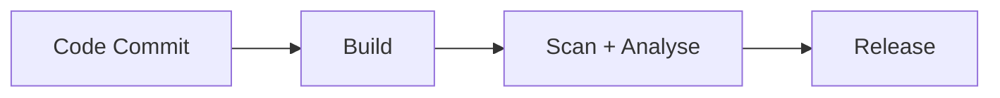

# ADR 004: CI/CD Quality Assurance

**Status:** Accepted | **Date:** 2025-03-10

## Context

Ensure security and integrity of software artifacts that are consumed by
infrastructure repositories per [ADR 010](../operations/010-configmgmt.md).
Threat actors exploit vulnerabilities in code, dependencies, container
images, and exposed secrets.

**Compliance Requirements:**

- [OWASP CI/CD Security](https://cheatsheetseries.owasp.org/cheatsheets/CI_CD_Security_Cheat_Sheet.html)
- [ACSC Software Development Guidelines](https://www.cyber.gov.au/resources-business-and-government/essential-cyber-security/ism/cyber-security-guidelines/guidelines-software-development)

## Decision

### CI/CD Pipeline Requirements

**Pipeline Flow**: Code Commit → Build & Test → Quality Assurance → Release

| Stage | Tools | Purpose | Mandatory |
|-------|-------|---------|-----------|
| **Build** | [Docker Bake](https://docs.docker.com/build/bake/) | Multi-platform builds with SBOM/provenance | Yes |
| **Scan** | [scc](https://github.com/boyter/scc) and [Trivy](https://trivy.dev/latest/docs/target/container_image/) | Complexity and Vulnerability scanning | Yes |
| **Analysis** | [GitHub CodeQL](https://docs.github.com/en/code-security/code-scanning/introduction-to-code-scanning/about-code-scanning-with-codeql) | Static code analysis | Yes |
| **Test** | [Playwright](https://playwright.dev/docs/intro) | End-to-end testing | Recommended |
| **Performance** | [Grafana K6](https://grafana.com/docs/k6/latest/get-started/write-your-first-test/) | Load testing | Optional |
| **API** | [Restish](https://rest.sh/#/guide) | API validation per [ADR 003](../development/003-apis.md) | Optional |

### Execution Environment

- Use [devcontainer-base](https://github.com/wagov-dtt/devcontainer-base)
  for standardised tooling
- Use [Docker Bake](https://docs.docker.com/build/bake/) to standardise
  builds
- Use [Justfiles](https://just.systems/man/en/) for task automation
- Use [GitHub Actions](https://docs.github.com/en/actions/about-github-actions/understanding-github-actions)
  for repository-hosted CI work that does not need AWS access, including
  lengthy builds, tests, and scans
- Run only AWS-privileged release or deployment automation from an
  operations-controlled environment, such as controlled
  [Woodpecker CI](https://woodpecker-ci.org/) runners

### AWS-Privileged Automation

Use operations-controlled automation only where release or deployment
steps need AWS credentials or direct access to AWS-hosted systems.

Required controls:

- Assume AWS roles at runtime; do not store long-lived cloud credentials
  in pipeline systems
- Run automation on dedicated, operations-managed hosts or workloads
- Limit network access to the AWS services and internal systems required
  for the job
- Apply strong access control, audit logging, and minimal administrative
  access
- Keep build, release, and deployment logs for audit and incident review

**CI/CD Pipeline:**

Build produces container images with SBOM/provenance. Scan runs
vulnerability and static analysis. Release produces static artifacts
consumed by [ADR 010: Infrastructure as Code](../operations/010-configmgmt.md).
Keep unprivileged build, test, and scan work on repository-hosted CI,
including long-running jobs. Move only AWS-privileged release or
deployment steps to an operations-controlled environment.

## Consequences

**Benefits:**

- Automated security scanning and vulnerability remediation
- Standardised artifact integrity and compliance alignment
- Consistent deployment pipelines with audit trails
- Clear separation between general CI checks and AWS-privileged
  automation

**Risks if not implemented:**

- Vulnerable containers deployed to production
- Exposed secrets or excessive cloud privilege in automation systems
- Manual security processes prone to human error
- Compliance violations and audit failures

## References

- [ADR 003: API Documentation Standards](../development/003-apis.md)
- [ADR 010: Infrastructure as Code](../operations/010-configmgmt.md)
