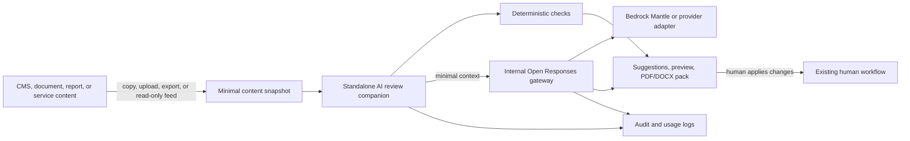

# Reference Architecture: AI-Assisted Digital Services

**Status:** Proposed | **Date:** 2026-06-17 | **Review:** 2027-06-17

## When to Use This Pattern

Use when adding low-risk AI assistance to a digital service, staff workflow,
content process, portal, CMS, data product, or API-backed application.

Start with this pattern when the team needs a simple companion tool for:

- Drafting, summarising, rewriting, and plain-English coaching
- Content quality, accessibility, and policy checks before formal review
- Staff productivity support over approved work documents
- Explanations or summaries of curated reports and service information
- Form-help, search-help, or service-officer assistance where humans remain
  accountable

Do not use this pattern for autonomous decisions, approvals, identity
proofing, entitlement decisions, fraud decisions, publishing, payments,
production changes, or actions that bypass human review.

## Overview

Build AI assistance as a **standalone review companion** first. The companion
accepts a minimal content snapshot through copy/paste, file upload, static
export, or a read-only preview feed. It returns suggestions, checks, preview
pages, and review packs for humans to use in existing workflows.

Do not start by deeply embedding AI into CMS, portal, identity, or business
workflow systems. Deep plugins and write-back integrations increase risk,
coupling, and adoption cost. Add them only after the standalone workflow is
proven and the owning system can support the integration safely.

The AI companion calls an internal gateway that implements an
[Open Responses](https://www.openresponses.org/) compatible API. Applications
and companion tools call the gateway, not model providers directly. The
gateway enforces approved models, data minimisation, logging, prompt
templates, token limits, and provider-specific privacy controls.

[Amazon Bedrock Mantle](https://docs.aws.amazon.com/bedrock/latest/userguide/bedrock-mantle.html)
is the preferred initial backend where suitable because it exposes a
Responses-style API through Amazon Bedrock and supports provider portability.
Use an Australian region where available. Requests must set `store: false` by
default so prompt and response content is not retained for conversation state.

## Simple Architecture



The source system remains the system of record. The companion does not need
privileged access and should not change workflow state. Humans copy accepted
changes back, upload reviewed files, or use existing CMS and approval paths.

## Roles and Responsibilities

| Party | Owns | Does not own |
|-------|------|--------------|
| Service, CMS, or app owner | Source content, business workflow, user context, final changes | Model credentials, provider selection, AI policy enforcement |
| AI companion team | Review UI, deterministic checks, preview/export handling, user experience | Publishing, approvals, identity proofing, business decisions |
| AI gateway team | Open Responses API, provider adapters, model allow-list, prompt policy, logging | Source-system workflow or content ownership |
| Content or business reviewer | Standards, acceptance, approval, and official use of outputs | Treating AI output as automatically correct |
| Security and privacy owners | Classification rules, provider approval, retention, monitoring requirements | Day-to-day drafting or editorial judgement |

## Integration Levels

| Level | Team does | Use when |
|-------|-----------|----------|
| 0. Manual companion | Paste text or upload a file; no source-system integration | Proving value quickly with minimal risk |
| 1. File-based review | Export Markdown, HTML, JSON, DOCX, or CSV snapshots; generate previews and review packs | The workflow needs repeatable review evidence |
| 2. Read-only feed | Consume a CMS preview feed, staging URL, report export, or API with minimal fields | The source system can provide safe read-only access |
| 3. Inline assistance | Add CMS, portal, or app UI integration for selected fields only | The standalone workflow is proven and integration risk is accepted |
| 4. Tool use or RAG | Add retrieval, tools, or agentic workflows | Only after separate risk assessment and approval |

Prefer levels 0-2 for the initial release. They are easier to secure, easier to
replace, and less disruptive to existing content workflows.

## Primary Journey: CMS Content Review

1. Author drafts content in the existing CMS or document workflow.
2. Author exports, copies, uploads, or previews only the content section being
   reviewed.
3. The companion runs deterministic checks first: readability, headings,
   links, required metadata, alt text presence, and obvious structure issues.
4. The companion sends only the minimum selected context to the AI gateway.
5. The gateway enforces model allow-list, region, prompt template, token
   limits, `store: false`, and logging.
6. The companion returns plain-English suggestions, likely WCAG 2.2 AA content
   issues, [Australian Government Style
   Manual](https://www.stylemanual.gov.au/) prompts, and structure
   suggestions. This supports WA Government Digital Services Policy Framework
   expectations for clear, accessible, user-centred public content.
7. The companion renders a preview that matches the CMS design system where
   practical.
8. The companion can generate PDF or DOCX review packs for file-based sharing
   and approval evidence.
9. The author accepts, edits, or rejects suggestions.
10. The author or reviewer applies accepted changes through the existing CMS or
    document workflow. Existing approval and publishing controls remain
    authoritative.

## Reference Implementation Shape

Start with a small web application or local/staff tool that can ingest content
without privileged source-system access:

- Copy/paste text, selected HTML, Markdown, or structured fields
- Upload DOCX, PDF, Markdown, HTML, CSV, or JSON where approved
- Import a static CMS export or a read-only preview feed
- Render a temporary preview site from the snapshot
- Export suggestions, before/after text, check results, and reviewer notes

For content platforms, prefer static site generation for preview and review
environments. [Hugo](https://gohugo.io/) is a sensible default for simple,
fast previews that can render the same information architecture, templates,
and design-system components used by the CMS.

Follow [ADR 020: Frontend UI
Foundations](../development/020-frontend-ui-foundations.md) for preview and
review surfaces. Prefer Bootstrap 5-compatible semantic HTML and component
conventions unless an agency design system or product constraint requires a
documented alternative.

Generate PDF or DOCX review packs from the same file-based snapshot when
reviewers need simple sharing, offline review, or approval evidence.

## Provider Portability

- Companion and application code must target the internal Open
  Responses-compatible gateway, not Bedrock, OpenAI, Anthropic, or other
  provider-specific APIs directly
- Keep model IDs, backend URLs, regions, token limits, and provider features in
  server-side configuration
- Run API compatibility or contract tests for gateway changes where practical
- Keep browser, mobile, CMS, and portal clients free of model-provider
  credentials
- Support provider-specific extensions only behind the gateway and only when
  the feature is justified for the use case

## Bedrock Mantle Guidance

When using Bedrock Mantle as the backend:

- Use the Bedrock Mantle endpoint for the selected region, not a public OpenAI
  endpoint
- Prefer `ap-southeast-2` where the workload and selected model support it
- Set `store: false` on every Responses API request unless a specific,
  approved use case requires retained conversation state
- Do not rely on provider-retained conversation history for official records;
  keep required evidence in agency-controlled logs
- Confirm model availability, quota, data residency, logging, and retention
  assumptions before production use

Example gateway request shape:

```json
{
  "model": "approved-model-id",
  "input": [
    {
      "role": "user",
      "content": "Rewrite this selected paragraph in plain English."
    }
  ],
  "store": false
}
```

## Data Minimisation and Safety Controls

- Send selected fields, paragraphs, snippets, or curated extracts rather than
  full records or broad context
- Remove unnecessary personal information, identifiers, attachments, comments,
  and workflow metadata before model calls
- Run deterministic checks first where rules are known, such as schema,
  readability, heading structure, required metadata, or broken-link checks
- Use prompt templates with versioning, review, and rollback
- Apply route, user, token, and cost limits at the gateway
- Fail closed when classification, provider, model, region, quota, or policy
  checks are uncertain
- Disable tool calls and source-system write-back by default

## Cross-Reference Use Cases

| Reference architecture | AI tie-in |
|------------------------|-----------|
| [Content Management](content-management.md) | Standalone content review companion, static preview, file review outputs, and compliance-left drafting checks |
| [OpenAPI Backend](openapi-backends.md) | Internal Open Responses-compatible gateway and provider abstraction |
| [Federated Application Portal](federated-application-portal.md) | Optional shared companion entry point through central services or SDK |
| [Data Pipelines](data-pipelines.md) | Summaries and explanations over curated outputs only |
| [Identity Management](identity-management.md) | Authentication and authorisation boundary; no AI identity decisions |

## What Good Looks Like

- The first release works without CMS schema changes, privileged CMS access, or
  publishing integration
- Authors can use the companion with copied text, uploaded files, or exported
  snapshots
- Preview and review packs are generated from the same content snapshot that
  was checked
- Accepted changes are applied through existing human workflows
- The gateway enforces approved providers, `store: false`, token limits,
  logging, and prompt-template versions
- The source system remains authoritative for workflow state, approval, and
  publishing

## Project Kickoff Steps

1. **Pick the lowest integration level** - Start with manual or file-based
   review before considering read-only feeds, inline plugins, tools, or RAG
2. **Confirm AI governance** - Follow [ADR 011: AI Tool and Agent
   Governance](../security/011-ai-governance.md) for approved tool use,
   human accountability, model-provider assessment, and audit evidence
3. **Define data boundaries** - Follow [ADR 015: Data Governance
   Standards](../operations/015-data-governance.md) for ownership,
   classification, retention, and minimum necessary disclosure
4. **Design the gateway API** - Follow [OpenAPI Backend](openapi-backends.md)
   and [ADR 003: API Documentation
   Standards](../development/003-apis.md) for the internal gateway contract,
   client schemas, validation, and compatibility tests
5. **Apply isolation** - Follow [ADR 001: Application
   Isolation](../security/001-isolation.md) for runtime, network, provider,
   and administrative boundaries
6. **Secure secrets and identity** - Follow [ADR 005: Secrets
   Management](../security/005-secrets-management.md) for model-provider
   credentials and [ADR 013: Identity Federation
   Standards](../security/013-identity-federation.md) for authenticated user
   access
7. **Log evidence** - Follow [ADR 007: Centralised Security
   Logging](../operations/007-logging.md) for prompts templates, model IDs,
   policy decisions, user actions, denied actions, and accepted outputs
8. **Release safely** - Follow [ADR 004: CI/CD Quality
   Assurance](../development/004-cicd.md) and [ADR 009: Release
   Standards](../development/009-release.md) for prompt, gateway, and client
   changes

## Implementation Checklist

- [ ] Initial release can operate as a standalone companion without privileged
      source-system access
- [ ] The chosen integration level and non-goals are documented
- [ ] AI Accountable Officer, tool approval, and model-provider assessment are
      documented
- [ ] Application clients call only the internal Open Responses-compatible
      gateway
- [ ] Provider credentials, model IDs, regions, and retention settings are
      controlled server-side
- [ ] `store: false` or an approved retention exception is enforced by the
      gateway
- [ ] Data classification, minimisation, and prompt-template rules are tested
- [ ] AI output cannot approve, publish, submit, delete, pay, authenticate,
      authorise, or change workflow state
- [ ] Logs record model ID, prompt template/version, policy decisions,
      generated output summary, user action, and accepted outputs
- [ ] Human review, fallback behaviour, rate limits, and incident response are
      documented

## Related ADRs

- [ADR 001: Application Isolation](../security/001-isolation.md)
- [ADR 003: API Documentation Standards](../development/003-apis.md)
- [ADR 004: CI/CD Quality Assurance](../development/004-cicd.md)
- [ADR 005: Secrets Management](../security/005-secrets-management.md)
- [ADR 007: Centralised Security Logging](../operations/007-logging.md)
- [ADR 009: Release Standards](../development/009-release.md)
- [ADR 011: AI Tool and Agent Governance](../security/011-ai-governance.md)
- [ADR 013: Identity Federation Standards](../security/013-identity-federation.md)
- [ADR 015: Data Governance Standards](../operations/015-data-governance.md)
- [ADR 020: Frontend UI Foundations](../development/020-frontend-ui-foundations.md)
