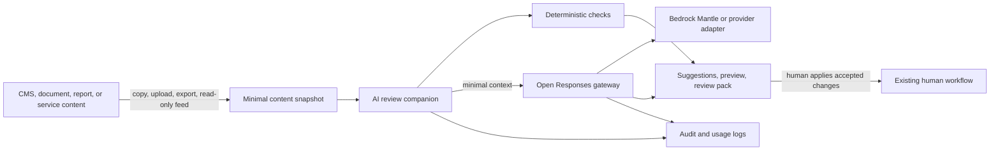

# Reference Architecture: AI-Assisted Digital Services

**Status:** Proposed | **Date:** 2026-06-17 | **Review:** 2027-06-17

## When to Use This Pattern

Use this pattern when adding low-risk AI assistance to a digital service, staff
workflow, content process, portal, CMS, data product, or API-backed
application.

Good first use cases:

- Drafting, summarising, rewriting, and plain-English coaching
- Content quality, accessibility, and policy checks before formal review
- Explanations or summaries of curated reports and service information
- Form-help, search-help, or staff support where humans remain accountable

For high-impact decisions, publishing, payments, identity proofing,
authorisation, fraud decisions, production changes, or agentic tool use, start
with [ADR 011: AI Tool and Agent
Governance](../security/011-ai-governance.md) and a separate risk assessment.

## Overview

Start with a **standalone review companion**. It accepts a minimal content
snapshot through copy/paste, file upload, static export, or read-only preview
feed. It returns checks, suggestions, previews, and review packs for humans to
use in existing workflows.

Keep the source system authoritative. Authors and reviewers apply accepted
changes through the existing CMS, portal, document, or business workflow.

Use an internal [Open Responses](https://www.openresponses.org/) compatible AI
gateway for model access. The gateway owns provider configuration, model
allow-lists, prompt templates, token limits, logging, and privacy settings.

[Amazon Bedrock Mantle](https://docs.aws.amazon.com/bedrock/latest/userguide/bedrock-mantle.html)
is the preferred initial backend where suitable. Use an Australian region where
available and set `store: false` by default.

## Simple Architecture



## Delivery Levels

| Level | Build | Use for |
|-------|-------|---------|
| 0. Manual companion | Paste text or upload files | Fast proof of value with minimal integration |
| 1. File-based review | Export Markdown, HTML, JSON, DOCX, CSV, or PDF snapshots | Repeatable checks, previews, and review evidence |
| 2. Read-only feed | Consume a CMS preview feed, staging URL, report export, or minimal API | Safer integration with existing platforms |
| 3. Inline assistance | Add selected-field UI integration | Proven workflows that justify deeper integration |
| 4. Retrieval or tools | Add RAG, tools, or agentic workflows | Separately assessed use cases with stronger controls |

Start at level 0 or 1 unless the project has a clear operational reason to do
more.

## CMS Content Review Journey

1. Author drafts content in the existing CMS or document workflow.
2. Author copies, uploads, exports, or previews the section for review.
3. Companion runs deterministic checks for readability, headings, links,
   metadata, alt text presence, and structure.
4. Companion sends only the minimum selected context to the AI gateway.
5. Gateway applies model allow-list, region, prompt template, token limit,
   `store: false`, and logging rules.
6. Companion returns plain-English suggestions, likely WCAG 2.2 AA content
   issues, [Australian Government Style
   Manual](https://www.stylemanual.gov.au/) prompts, and structure
   suggestions.
7. Companion renders a CMS-aligned preview and optional PDF/DOCX review pack.
8. Author accepts, edits, rejects, or applies suggestions through the existing
   CMS workflow.

## Reference Implementation

Build a small web application or staff tool with:

- Copy/paste and file upload for text, HTML, Markdown, DOCX, PDF, CSV, or JSON
- Optional import from static CMS export or read-only preview feed
- Deterministic checks before model calls
- Open Responses gateway client with `store: false` enforced server-side
- Prompt template versioning and rollback
- Preview site generation from the same checked snapshot
- Exportable before/after suggestions, check results, reviewer notes, and
  PDF/DOCX review packs

Use [Hugo](https://gohugo.io/) for static preview and review sites where
practical. Use [ADR 020: Frontend UI
Foundations](../development/020-frontend-ui-foundations.md) for preview UI,
semantic HTML, and Bootstrap 5-compatible component conventions.

## Gateway Requirements

The AI gateway should:

- Expose an Open Responses-compatible API to companion and application clients
- Keep model-provider credentials out of browsers, mobile apps, CMS plugins,
  and portal widgets
- Keep model IDs, backend URLs, regions, token limits, and provider options in
  server-side configuration
- Enforce `store: false` by default for Bedrock Mantle Responses API requests
- Log model ID, prompt template/version, policy decisions, output summary, user
  action, and accepted outputs
- Apply per-route, per-user, token, rate, and cost limits
- Validate request and response schemas in CI where practical

Example gateway request shape:

```json
{
  "model": "approved-model-id",
  "input": [
    {
      "role": "user",
      "content": "Rewrite this selected paragraph in plain English."
    }
  ],
  "store": false
}
```

## Data Handling Rules

- Send selected fields, paragraphs, snippets, or curated extracts rather than
  full records
- Remove unnecessary personal information, identifiers, attachments, comments,
  and workflow metadata before model calls
- Keep source-system write-back, privileged actions, and tool calls disabled
  until separately assessed
- Keep required evidence in agency-controlled logs rather than relying on
  provider-retained conversation state
- Escalate when classification, provider, model, region, quota, or policy
  checks are unclear

## Roles and Responsibilities

| Party | Owns |
|-------|------|
| Service, CMS, or app owner | Source content, user context, business workflow, final changes |
| AI companion team | Review UI, deterministic checks, preview/export handling, user experience |
| AI gateway team | Open Responses API, provider adapters, model allow-list, prompt policy, logging |
| Content or business reviewer | Standards, acceptance, approval, and official use of outputs |
| Security and privacy owners | Classification rules, provider approval, retention, and monitoring requirements |

## Cross-Reference Use Cases

| Reference architecture | AI tie-in |
|------------------------|-----------|
| [Content Management](content-management.md) | Content review companion, static preview, file review outputs, and compliance-left drafting checks |
| [OpenAPI Backend](openapi-backends.md) | Internal Open Responses-compatible gateway and provider abstraction |
| [Federated Application Portal](federated-application-portal.md) | Optional shared companion entry point through central services or SDK |
| [Data Pipelines](data-pipelines.md) | Summaries and explanations over curated outputs |
| [Identity Management](identity-management.md) | Authentication and authorisation boundary; no AI identity decisions |

## Implementation Checklist

- [ ] Initial release level is selected and documented
- [ ] AI Accountable Officer, tool approval, and provider assessment are recorded
- [ ] Data classification and minimisation rules are implemented
- [ ] Companion clients call only the internal Open Responses-compatible gateway
- [ ] Provider credentials and provider options are controlled server-side
- [ ] `store: false` is enforced by default for Bedrock Mantle requests
- [ ] Deterministic checks run before model calls where rules are known
- [ ] Logs capture model ID, prompt template/version, policy decisions, output
      summary, user action, and accepted outputs
- [ ] Human review, fallback behaviour, rate limits, and incident response are
      documented

## Related ADRs

- [ADR 001: Application Isolation](../security/001-isolation.md)
- [ADR 003: API Documentation Standards](../development/003-apis.md)
- [ADR 004: CI/CD Quality Assurance](../development/004-cicd.md)
- [ADR 005: Secrets Management](../security/005-secrets-management.md)
- [ADR 007: Centralised Security Logging](../operations/007-logging.md)
- [ADR 009: Release Standards](../development/009-release.md)
- [ADR 011: AI Tool and Agent Governance](../security/011-ai-governance.md)
- [ADR 013: Identity Federation Standards](../security/013-identity-federation.md)
- [ADR 015: Data Governance Standards](../operations/015-data-governance.md)
- [ADR 020: Frontend UI Foundations](../development/020-frontend-ui-foundations.md)
