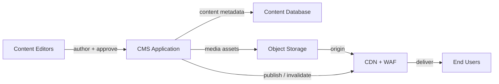

# Reference Architecture: Content Management

**Status:** Proposed | **Date:** 2025-07-28 | **Review:** 2026-07-28

## When to Use This Pattern

Use when building:

- Public websites and intranets
- Content portals with editorial workflows
- Headless CMS backends for mobile apps or multi-channel publishing

Do not use this pattern for simple static sites that can be generated at
build time without editorial workflows.

## Overview

Build content platforms with a small CMS runtime, managed database,
object-backed media storage, and CDN/WAF delivery. Keep authoring,
storage, and delivery concerns separate so content editors can work
safely while public users only reach cached, protected endpoints.

## Core Components

## Project Kickoff Steps

### Foundation Setup

1. **Apply Isolation** - Follow [ADR 001: Application
   Isolation](../security/001-isolation.md) for CMS service network,
   runtime, and environment separation
2. **Deploy CMS Runtime** - Follow [ADR 002: AWS EKS for Cloud
   Workloads](../operations/002-workloads.md) for the CMS application and
   background workers
3. **Configure Infrastructure** - Follow [ADR 010: Infrastructure as
   Code](../operations/010-configmgmt.md) for reproducible database,
   storage, CDN, and runtime deployments
4. **Setup Storage** - Follow [ADR 018: Database
   Patterns](../operations/018-database-patterns.md) for the content
   database and [ADR 019: Shared File
   Access](../operations/019-shared-file-access.md) when editorial or
   processing workloads need shared file access to media assets

### Security & Operations

1. **Configure Secrets Management** - Follow [ADR 005: Secrets
   Management](../security/005-secrets-management.md) for database,
   CMS, identity, and API credentials
2. **Setup Logging** - Follow [ADR 007: Centralised Security
   Logging](../operations/007-logging.md) for audit trails, publishing
   events, and administrative actions
3. **Setup Backup Strategy** - Follow [ADR 014: Object Storage
   Backups](../operations/014-object-backup.md) for content database,
   media asset, and configuration recovery
4. **Configure Edge Protection** - Follow [ADR 016: Web Application
   Edge Protection](../security/016-edge-protection.md) for CDN, WAF,
   origin protection, and cache rules
5. **Identity Integration** - Follow [ADR 013: Identity Federation
   Standards](../security/013-identity-federation.md) and [ADR 012:
   Privileged Remote Access](../security/012-privileged-remote-access.md)
   for editorial and administrative access
6. **Optional AI Review Companion** - Follow [AI-Assisted Digital
   Services](ai-assisted-digital-services.md) when adding standalone drafting,
   readability, accessibility, or policy checks around the authoring experience
7. **Configure Preview and Review Outputs** - Use a simple static preview and
   file-export path where this reduces impact on existing CMS workflows

### Implementation Details

**Content Model & Editorial:**

- Define content types, ownership, approval stages, and publishing rules
  before selecting CMS plugins or custom fields
- Use role-based editorial workflows for draft, review, approval, and
  publishing steps
- Keep administrative CMS endpoints separate from public delivery paths
- Implement headless CMS APIs following [ADR 003: API Documentation
  Standards](../development/003-apis.md) where content is consumed by
  other applications

**Preview & Review Workflow:**

- Use static site generation for preview and review environments where the CMS
  can export draft content into files or a headless preview feed
- Prefer [Hugo](https://gohugo.io/) for simple, fast previews that render the
  same information architecture, templates, and design-system components used
  by the CMS
- Keep preview tooling aligned with the CMS design system but outside the core
  authoring workflow where practical, so CMS upgrades, editorial permissions,
  and third-party widgets are not tightly coupled to AI tooling
- Follow [ADR 020: Frontend UI
  Foundations](../development/020-frontend-ui-foundations.md) for CMS-facing
  preview templates and review tooling. Prefer Bootstrap 5-compatible semantic
  HTML and component conventions unless an agency design system or product
  constraint requires a documented alternative.
- Generate PDF or DOCX review packs from the same file-based content snapshot
  when simple document sharing, offline review, or approval evidence is needed

**Optional AI Review Companion:**

- Use [AI-Assisted Digital Services](ai-assisted-digital-services.md) for
  standalone drafting, readability, accessibility, and policy coaching
- Prefer copy/paste, file upload, static export, or read-only preview feeds
  before building CMS plugins or write-back integrations
- Send only the selected paragraph, page section, metadata field, or exported
  snapshot needed for the check
- Run deterministic checks for readability, links, headings, alt text, and
  required metadata before model calls
- Return suggestions for authors to accept, edit, reject, or copy back through
  the existing CMS workflow
- Do not allow AI assistance to approve content, publish content, move workflow
  state, bypass reviewer approval, or access privileged CMS administration APIs
- Prefer standalone preview and file-output workflows for AI-assisted review
  where this makes the tool usable across multiple CMS, staging, and local
  environments

**Media & Delivery:**

- Store media assets in object storage as the source of truth
- Use [ADR 019: Shared File
  Access](../operations/019-shared-file-access.md) only when authoring,
  processing, or migration tools need file-system semantics
- Serve public media through CDN/WAF per [ADR 016: Web Application Edge
  Protection](../security/016-edge-protection.md)
- Configure cache keys, TTLs, and invalidation for publishing workflows

**Compliance & Quality:**

- Test WCAG 2.2 AA accessibility before publishing templates or major
  content changes
- Shift WA Government Digital Services Policy Framework expectations left into
  the drafting process where practical, using the [Australian Government Style
  Manual](https://www.stylemanual.gov.au/) as practical guidance for clear,
  consistent, accessible, user-centred public content alongside WCAG 2.2 AA
  checks
- Apply content retention, disposal, and ownership rules per [ADR 015:
  Data Governance Standards](../operations/015-data-governance.md)
- Configure privacy notices, cookie consent, and multilingual content
  where required
- Monitor content performance, broken links, publishing failures, and CDN
  cache effectiveness
