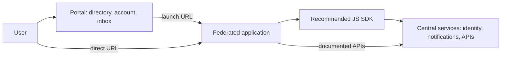

# Reference Architecture: Federated Application Portal

**Status:** Proposed | **Date:** 2026-06-16 | **Review:** 2027-06-16

## When to Use This Pattern

Use when building a portfolio of standalone web applications that:

- Are operated by multiple agencies, business units, or delivery partners
- Share central identity, account management, notifications, and common APIs
- Need an authenticated app directory, shared inbox, or account widget
- Must work as normal websites, PWAs, and mobile app webviews

Do not use this pattern to force unrelated applications into one frontend
runtime. Each federated application remains independently deployable and
usable without the portal shell.

## Overview

The portal is the central user-facing entry point and shared service
platform. It provides the authenticated app directory, account experience,
shared inbox, recommended JavaScript SDK, and common APIs. It does **not**
host or own each federated application's business logic or release cadence.

Federated applications integrate through OIDC, documented APIs, and the
recommended SDK. The SDK makes hard parts easy: authentication, session
management, account handoff, inbox and notification integration, PWA support,
and lightweight mobile-webview handoff.

This design minimises lock-in and integration burden by keeping applications
independently deployable, using OIDC and documented APIs as the baseline
contract, and treating the SDK as a convenience layer rather than the only
integration path.

## Simple Architecture

## Roles and Responsibilities

| Party | Owns | Does not own |
|-------|------|--------------|
| Federated app owner | App UX, business data, app authorisation, OIDC client config, SDK integration | Central account, shared inbox, mobile shell |
| Portal/mobile owner | Directory, account UI, shared inbox UX, native bridge, mobile shell | Federated app business logic or releases |
| Platform/SDK team | SDK, common APIs, identity/account/notification integration, compatibility, observability | Federated app delivery |

## Integration Levels

| Level | App owner does | User benefit |
|-------|----------------|--------------|
| Minimum | Register launch URL and OIDC client | App appears in directory and uses central sign-in |
| Recommended | Add SDK | Easier sessions, account widget, inbox, notifications, PWA, and webview handoff |
| Advanced | Add notification events, deep links, and optional app-card state | Richer inbox journeys and contextual app launch |

## Primary User Journey

1. User opens the authenticated portal directory
2. Portal shows approved app cards with icons and short descriptions
3. User selects an app card
4. Portal opens the app's registered launch URL
5. The app starts its own OIDC flow with its registered client
6. Existing central session enables silent redirect or SSO where possible
7. User lands in the standalone federated application

## Experience Mockups

These lightweight HTML mockups show intent only. They are not final product
designs.

<!-- markdownlint-disable MD033 -->

  

    <strong>Example Portal</strong>
    Portal · 📥 3 · 👤 Me
  

  
Search services... &nbsp; <button>Filter</button>

  

    

      <strong>🚗 App A</strong> 
      Do a common task 
      <small>Recently used</small> 
      <button>Open</button>
    

    

      <strong>⚠️ App B</strong> 
      Check status or alerts 
      <small>2 new items</small> 
      <button>Open</button>
    

    

      <strong>🪪 App C</strong> 
      View records 
      <small>Action due</small> 
      <button>Open</button>
    

  

App-card state is optional. Start with static metadata such as icon, name,
blurb, and launch URL. Add personalised state only through explicit
contracts, consent, and data minimisation.

  

    <strong>Example Federated App</strong>
    

      
Portal · 📥 3 · 👤 Me

      

        <strong>Portal menu</strong>
        
📥 Inbox 3

        
👤 Account details

        
🔔 Notification settings

        
✅ Consent and privacy

      

    

  

  

    
<strong>App-owned service content</strong>

    
This area is the federated application's primary user journey.

    <button>Start task</button> <button>View status</button>
    <button>Upload evidence</button>
  

  
<small>The app owns the page, journey, data, and authorisation. The portal widget stays peripheral and opens shared account, inbox, notification, or consent actions only when the user asks.</small>

  

    Back<strong>Mobile shell</strong>📥 3 · 👤
  

  

    <strong>Embedded federated app</strong>
    
App-specific task or status page

    <button>Continue task</button>
    
<small>Account, inbox, directory, and notification actions hand off to native UI through the approved SDK bridge.</small>

  

<!-- markdownlint-enable MD033 -->

## Project Kickoff Steps

1. **Define ownership and trust boundaries** - Follow [ADR 001:
   Application Isolation](../security/001-isolation.md) to separate central
   platform services, federated app runtimes, tenant data, SDK delivery, and
   mobile host bridge responsibilities
2. **Design identity and account flows** - Follow [Identity
   Management](identity-management.md) and [ADR 013: Identity Federation
   Standards](../security/013-identity-federation.md) for OIDC-first login,
   PKCE for browser public clients, claims, consent, step-up authentication,
   silent SSO, and account-management handoff
3. **Define API contracts** - Follow [OpenAPI Backend](openapi-backends.md)
   and [ADR 003: API Documentation Standards](../development/003-apis.md)
   for central APIs, app APIs, SDK-facing schemas, and compatibility tests
4. **Protect web entry points** - Follow [ADR 016: Web Application Edge
   Protection](../security/016-edge-protection.md) for CDN, WAF, TLS, origin
   protection, rate limits, and browser security headers
5. **Release the SDK safely** - Follow [ADR 004: CI/CD
   Standards](../development/004-cicd.md) and [ADR 009: Release
   Standards](../development/009-release.md) for SDK versioning,
   deprecation windows, compatibility matrices, and consumer test fixtures
6. **Publish the app directory** - Define app icons, descriptions,
   eligibility rules, launch URLs, OIDC client mappings, and SSO behaviour
   before onboarding applications
7. **Secure data, secrets, and logs** - Follow [ADR 005: Secrets
   Management](../security/005-secrets-management.md), [ADR 007:
   Centralised Security Logging](../operations/007-logging.md), [ADR 015:
   Data Governance Standards](../operations/015-data-governance.md), and
   [ADR 018: Database Patterns](../operations/018-database-patterns.md)

## Implementation Notes

- Applications must remain directly reachable by URL and usable without the
  portal landing page or native mobile app
- Use registered launch URLs from the authenticated app directory. The app
  starts its own OIDC flow; the identity platform provides silent redirect or
  SSO where possible.
- Recommend the SDK, but keep documented API access available so the SDK does
  not become a lock-in boundary
- Keep on-page SDK UI small and consistently branded, such as a top-right
  portal widget. Use widget dropdowns or focused overlays for account, inbox,
  notification, and consent actions instead of taking over the federated app
  page.
- Use PKCE-capable public-client flows. Do not require client secrets in
  browser or PWA code.
- Participating apps decide when a business notification is needed. The
  central notification service owns delivery preferences, shared inbox
  display, delivery channels, and audit logging.
- Webview handoff must fail closed. Native bridge messages must be
  allow-listed, versioned, origin-bound, and auditable.
- PWA and webview features must degrade safely when service workers, storage,
  push notifications, native bridges, or deep links are unavailable

## Implementation Checklist

- [ ] Owners and support responsibilities are documented
- [ ] App directory metadata, launch URLs, OIDC clients, and SSO behaviour are
      documented
- [ ] Browser, PWA, and mobile-webview behaviours are tested for critical
      journeys
- [ ] SDK APIs, OpenAPI contracts, TypeScript types, and compatibility
      guarantees are published
- [ ] Native bridge actions are allow-listed, versioned, origin-bound, and
      audited
- [ ] Identity claims, account attributes, consent records, and notification
      data flows are minimised and classified
- [ ] Central services have runbooks, rate limits, audit logs, and fallback
      behaviours

## Related ADRs

- [ADR 001: Application Isolation](../security/001-isolation.md)
- [ADR 003: API Documentation Standards](../development/003-apis.md)
- [ADR 004: CI/CD Standards](../development/004-cicd.md)
- [ADR 005: Secrets Management](../security/005-secrets-management.md)
- [ADR 007: Centralised Security Logging](../operations/007-logging.md)
- [ADR 009: Release Standards](../development/009-release.md)
- [ADR 013: Identity Federation Standards](../security/013-identity-federation.md)
- [ADR 015: Data Governance Standards](../operations/015-data-governance.md)
- [ADR 016: Web Application Edge Protection](../security/016-edge-protection.md)
- [ADR 018: Database Patterns](../operations/018-database-patterns.md)
