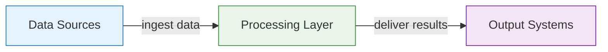

# Reference Architecture: Pattern Name

**Status:** Proposed | **Date:** YYYY-MM-DD | **Review:** YYYY-MM-DD

Set `Review` to one year after `Date`.

## When to Use This Pattern

Clear use case description for when to apply this architecture.

Do not use this pattern when a simpler documented approach meets the need.

## Overview

Brief template description focusing on practical implementation.

## Core Components

## Project Kickoff Steps

1. **Step Name** - Follow relevant ADRs for implementation
2. **Next Step** - *ADR needed for missing standards*
3. **Final Step** - Reference to existing practices

## Implementation Checklist

- [ ] Relevant ADRs have been reviewed with the delivery team
- [ ] Security, privacy, and data classifications are documented
- [ ] Runtime, data, and administrative trust boundaries are clear
- [ ] Logging, backup, and release responsibilities are assigned

## Related ADRs

- ADR ###: Related Decision
