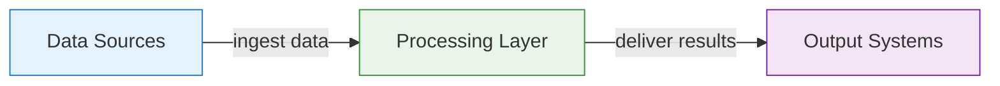

# Reference Architecture: Pattern Name

**Status:** Proposed | **Date:** YYYY-MM-DD

## When to Use This Pattern

Clear use case description for when to apply this architecture.

## Overview

Brief template description focusing on practical implementation.

## Core Components

## Project Kickoff Steps

1. **Step Name** - Follow relevant ADRs for implementation
2. **Next Step** - *ADR needed for missing standards*
3. **Final Step** - Reference to existing practices
